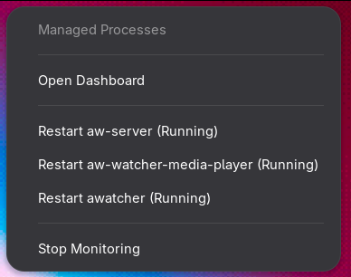

# aw-tray-control

[](https://github.com/ImGabe/aw-tray-control/actions/workflows/ci.yml)
[](https://github.com/ImGabe/aw-tray-control/releases)
[](https://deps.rs/repo/github/ImGabe/aw-tray-control)
[](./LICENSE)

A lightweight Linux system tray controller for ActivityWatch.

It starts and supervises configured ActivityWatch processes, exposes a tray menu, and gives quick access to the dashboard.



## AI Transparency Notice

This project is "vibe coded": generative AI tools were used during design and implementation.

If you prefer not to use AI-assisted projects, please evaluate this repository before adopting it.
All contributions are expected to be reviewed by humans for correctness, security, and license compliance.

## What You Get

- Loads configuration from the XDG config directory
- Verifies executable dependencies before startup
- Starts and tracks managed processes
- Exposes tray actions for opening the dashboard and stopping monitoring
- Handles `SIGINT`/`SIGTERM` for graceful shutdown

## Quick Start

```bash
cargo run --bin aw-tray-control
```

Utility entrypoint:

```bash
./scripts/utils.sh help
```

## Installation Options

- Source (recommended for development): `cargo run --bin aw-tray-control`
- Local install to user binary dir: `./scripts/install-binary.sh --binary-root "$HOME/.local"`
- Install from GitHub release tarball: `./scripts/install-from-release.sh --version 0.1.0 --autostart --force`
- Desktop launcher + autostart: `./scripts/install-desktop-entry.sh --autostart --force`
- Prebuilt binaries: download from [GitHub Releases](https://github.com/ImGabe/aw-tray-control/releases)

## Releases

Stable builds are published in GitHub Releases as:

- `aw-tray-control-<version>-x86_64-unknown-linux-gnu.tar.gz`
- `aw-tray-control-<version>-x86_64-unknown-linux-gnu.tar.gz.sha256`

Example verification flow:

```bash
sha256sum -c aw-tray-control-0.1.0-x86_64-unknown-linux-gnu.tar.gz.sha256
tar -xzf aw-tray-control-0.1.0-x86_64-unknown-linux-gnu.tar.gz
./aw-tray-control
```

## Requirements

Minimum for local checks and scripts:

- Rust toolchain (stable)
- Bash 4+
- `shellcheck`
- `pkg-config`
- `libdbus-1-dev` (or distro equivalent)

For full CI-equivalent security checks (optional but recommended):

- `cargo-audit`
- `cargo-deny`

Install security tools:

```bash
cargo install cargo-audit --locked --force
cargo install cargo-deny --locked --force
```

## Configuration

On first run, a default config is created at:

- `~/.config/aw-tray/config.toml`

Example:

```toml
dashboard_url = "http://localhost:5600"
process_paths = [
  "/home/user/.local/opt/activitywatch/aw-server/aw-server",
  "/home/user/.cargo/bin/aw-watcher-media-player",
  "/home/user/.cargo/bin/awatcher",
]
```

## Desktop Compatibility Notes

`aw-tray-control` uses Linux tray standards (`StatusNotifierItem`/AppIndicator behavior depends on the desktop environment).

Current validated environment (maintainer machine):

- Desktop: GNOME on Wayland
- GNOME Shell version: 49.5
- AppIndicator extension: required and installed (`appindicatorsupport@rgcjonas.gmail.com`)

| Environment | Tray support | Validation level | Notes |
| --- | --- | --- | --- |
| GNOME (Wayland) | Works with extension | Tested | Tested on GNOME Shell 49.5; requires AppIndicator extension |
| GNOME (X11) | Likely works with extension | Not yet tested | Same extension requirement expected |
| KDE Plasma | Native support | Not yet tested | Should work with StatusNotifierItem |
| X11 desktops (XFCE, Cinnamon, etc.) | Usually works out of the box | Not yet tested | Depends on tray/AppIndicator host availability |

> [!IMPORTANT]
> On GNOME, tray icons can be hidden by default. If the icon does not appear, install an AppIndicator-compatible extension (for example [AppIndicator and KStatusNotifierItem Support](https://extensions.gnome.org/extension/615/appindicator-support/)).

## Troubleshooting

Quick diagnostics command:

```bash
./scripts/doctor.sh
```

### Tray icon does not appear on GNOME

1. Confirm GNOME extension is installed:

```bash
gnome-extensions list | grep appindicatorsupport@rgcjonas.gmail.com
```

2. Install extension if missing:

- https://extensions.gnome.org/extension/615/appindicator-support/

3. Restart GNOME Shell session (logout/login) and run the app again.

### Binary installed but command not found

Ensure your user binary path is in `PATH`:

```bash
echo "$PATH" | tr ':' '\n' | grep "$HOME/.local/bin"
```

If missing, add `~/.local/bin` to your shell profile and restart the terminal.

### Desktop entry exists but does not launch

Regenerate launcher with explicit binary path:

```bash
./scripts/install-desktop-entry.sh --autostart --force --exec-path "$HOME/.local/bin/aw-tray-control"
```

## How to Update

### Update from source

```bash
git pull
cargo build --release
./scripts/install-binary.sh --binary-root "$HOME/.local"
./scripts/install-desktop-entry.sh --autostart --force --exec-path "$HOME/.local/bin/aw-tray-control"
```

### Update from release tarball

```bash
./scripts/install-from-release.sh --version <version> --autostart --force
```

## Development

Recommended flow (via `utils.sh`):

```bash
./scripts/utils.sh dev-check --fast
./scripts/utils.sh doctor
./scripts/utils.sh dev-run --log-level debug
./scripts/utils.sh reinstall-local --autostart --force
./scripts/utils.sh uninstall --desktop-only
```

Raw cargo checks:

```bash
cargo fmt --all
cargo clippy --all-targets --all-features -- -D warnings
cargo test --workspace --all-targets --all-features
cargo check --workspace --all-targets --all-features
```

Full local CI parity (when security tools are installed):

```bash
./scripts/dev-check.sh --fast
./scripts/dev-check.sh
shellcheck -x scripts/*.sh
cargo audit
cargo deny check advisories bans sources
```

Useful direct scripts:

```bash
./scripts/dev-run.sh
./scripts/dev-run.sh --release
./scripts/dev-run.sh --log-level debug -- --help
./scripts/reinstall-local.sh --force
./scripts/reinstall-local.sh --autostart --force
./scripts/reinstall-local.sh --binary-root "$HOME/.local" --autostart --force
```

## Desktop Launcher

Launcher template: `desktop/aw-tray-control.desktop`

Install launcher:

```bash
./scripts/install-desktop-entry.sh
```

Install launcher + autostart:

```bash
./scripts/install-desktop-entry.sh --autostart --force
```

Binary resolution order:

1. `--exec-path` value (if provided)
2. `aw-tray-control` found in `PATH`

Explicit binary path:

```bash
./scripts/install-desktop-entry.sh --exec-path "$HOME/.local/bin/aw-tray-control"
```

Production-like install flow:

```bash
./scripts/install-binary.sh
./scripts/install-desktop-entry.sh --autostart --force
```

Custom binary root:

```bash
./scripts/install-binary.sh --binary-root "$HOME/.local"
./scripts/install-desktop-entry.sh --autostart --force --exec-path "$HOME/.local/bin/aw-tray-control"
```

Dry-run:

```bash
./scripts/install-binary.sh --dry-run
./scripts/install-desktop-entry.sh --autostart --dry-run
```

## Uninstall

Default (binary + desktop + autostart):

```bash
./scripts/uninstall.sh
```

Only desktop/autostart:

```bash
./scripts/uninstall.sh --desktop-only
```

Only binary:

```bash
./scripts/uninstall.sh --keep-desktop
```

Custom cargo root:

```bash
./scripts/uninstall.sh --binary-root "$HOME/.local"
```

Dry-run:

```bash
./scripts/uninstall.sh --dry-run
```

Desktop-entry removal commands:

```bash
./scripts/install-desktop-entry.sh --remove
./scripts/install-desktop-entry.sh --remove-autostart
```

## Community

- Contribution guide: [CONTRIBUTING.md](./CONTRIBUTING.md)
- Code of conduct: [CODE_OF_CONDUCT.md](./CODE_OF_CONDUCT.md)
- Security policy: [SECURITY.md](./SECURITY.md)
- Release process: [RELEASING.md](./RELEASING.md)
- Roadmap: [ROADMAP.md](./ROADMAP.md)

## License

Licensed under the GNU Affero General Public License, version 3 or later:

- `AGPL-3.0-or-later`
- See `LICENSE`
